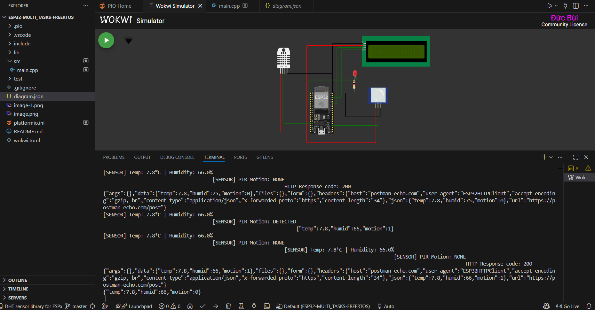

# ESP32 Multi-tasking with FreeRTOS

## Giới thiệu
Dự án này trình bày cách sử dụng FreeRTOS trên ESP32 để thực hiện đa nhiệm (multi-tasking) với 3 nhiệm vụ:

- **Task 1:** Nhấp nháy LED trạng thái (GPIO2) và LED báo PIR (GPIO32).
- **Task 2:** Đọc dữ liệu cảm biến nhiệt độ, độ ẩm (DHT22, GPIO13) và cảm biến chuyển động PIR (GPIO15).
- **Task 3:** Gửi dữ liệu cảm biến lên server qua HTTP POST (dạng JSON).

## Cấu trúc thư mục dự án

```
ESP32-MULTI_TASKS-FREERTOS/
├── include/           # Header files (nếu có)
├── lib/               # Thư viện ngoài (nếu có)
├── src/
│   └── main.cpp       # Code chính
├── test/              # Test code (nếu có)
├── platformio.ini     # Cấu hình PlatformIO
├── diagram.json       # Sơ đồ kết nối Wokwi
├── wokwi.toml         # Cấu hình mô phỏng Wokwi
├── README.md          # Tài liệu này
└── ... (ảnh minh hoạ, video demo)
```


## Sơ đồ phần cứng

- ESP32 DevKit v4
- DHT22 data → GPIO13
- PIR OUT → GPIO15
- LED trạng thái → GPIO2
- LED báo PIR → GPIO32

### Minh hoạ kết nối


## Video minh hoạ

- [YouTube Demo](https://www.youtube.com/watch?v=e1O58hB72mY)

## Hướng dẫn build & chạy

1. **Cài đặt thư viện:**
	 - PlatformIO sẽ tự động cài các thư viện cần thiết (DHTesp, ArduinoJson, HTTPClient, WiFi).

2. **Nạp code lên ESP32:**
	 - Kết nối ESP32 với máy tính.
	 - Mở thư mục dự án này bằng VSCode + PlatformIO.
	 - Build và upload firmware:
		 ```cmd
		 pio run -t upload
		 ```

3. **Kết nối WiFi:**
	 - Mặc định sử dụng WiFi `Wokwi-GUEST` (có thể thay đổi trong code).

4. **Quan sát Serial Monitor:**
	 - Xem log cảm biến và phản hồi từ server.

## Chức năng chính

- LED nhấp nháy liên tục để báo trạng thái hoạt động.
- Đọc và hiển thị nhiệt độ, độ ẩm, trạng thái chuyển động PIR.
- Gửi dữ liệu cảm biến lên server `https://postman-echo.com/post` theo định dạng JSON:
	```json
	{
		"temp": <giá trị nhiệt độ>,
		"humid": <giá trị độ ẩm>,
		"motion": <0 hoặc 1>
	}
	```

## Tài liệu tham khảo

- [Yêu cầu chi tiết & hướng dẫn](https://docs.google.com/document/d/1s0GCPdVyUdRB-I33-zEpp38XXBoiJyie/edit?usp=sharing)


